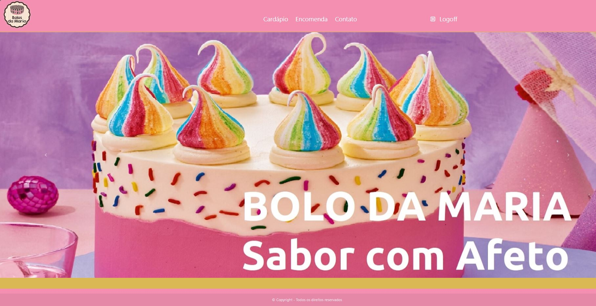
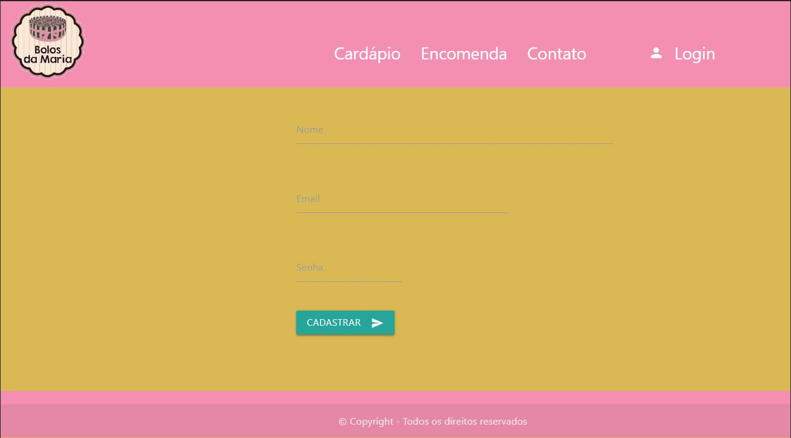
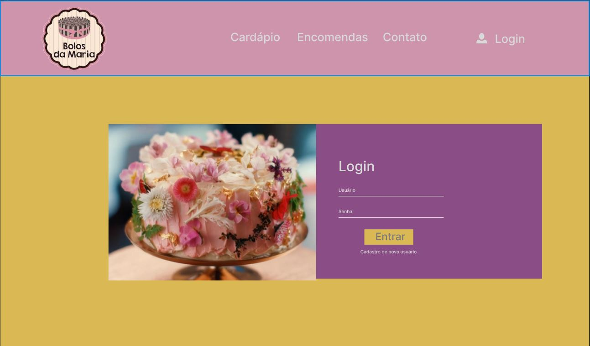
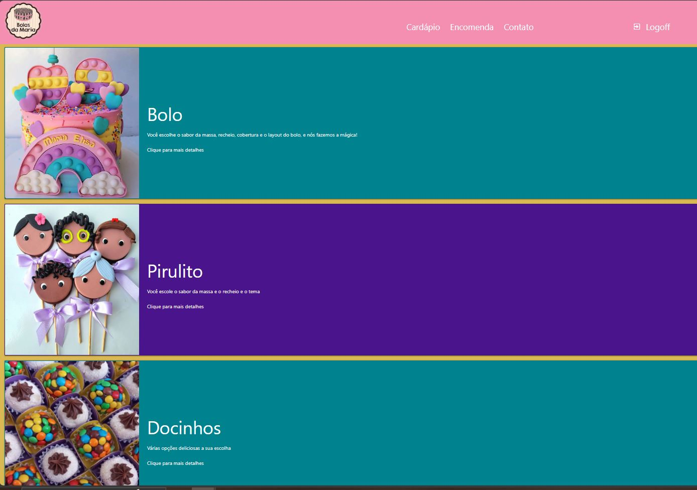
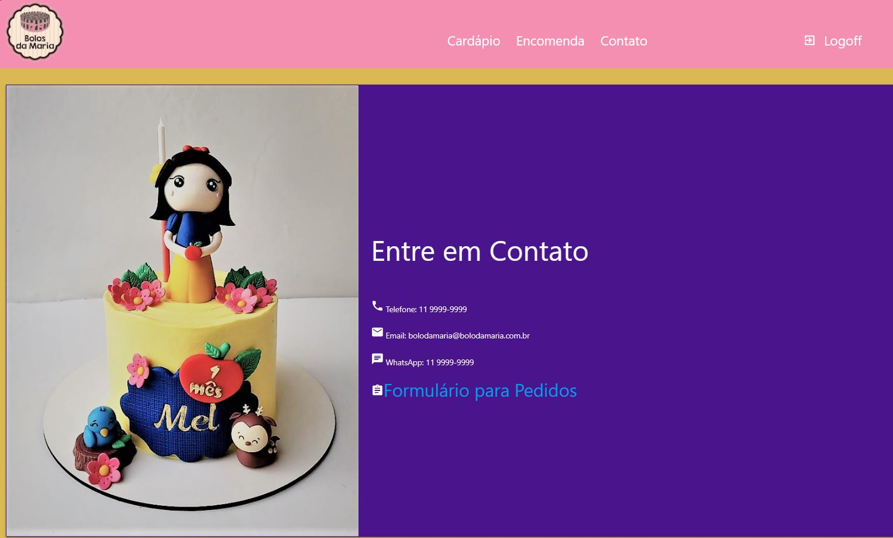
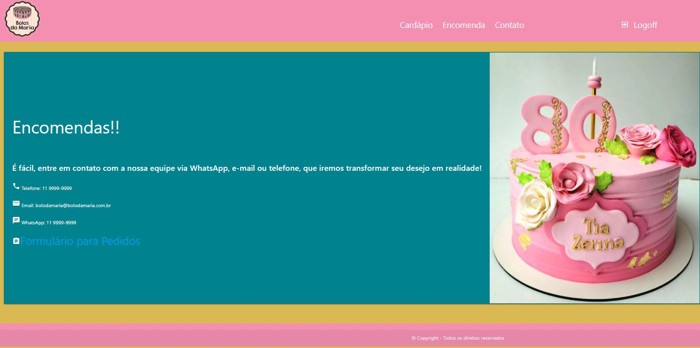
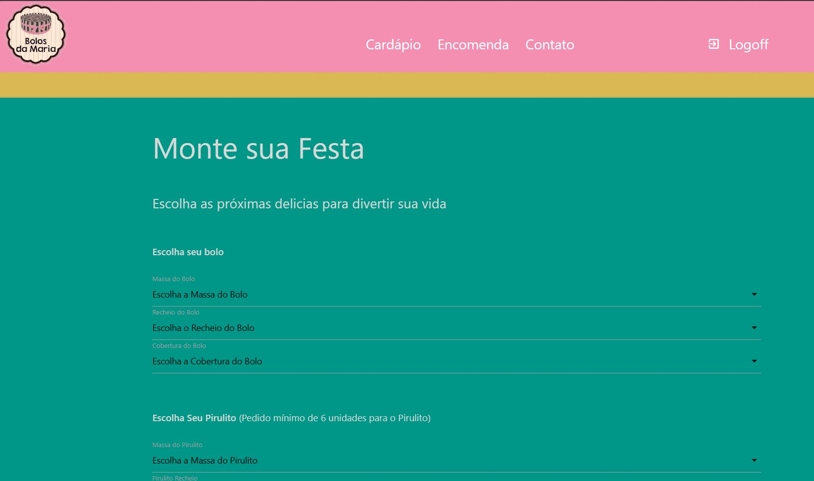

# Bolos da Maria

  
A página do Bolo da Maria foi desenhada para venda de doces sem a utilização de programas de vendas direta, que permitem que as pessoas visualizem e peçam o que precisem via Whatsapps através de um formulário 

 
 

  
Página Home

  

 

  
Cadastro do Usuário

  

 

  
Login

  

 

  
Cardápio

  

 

  
Contato

  

 

  
Encomendas

  

 

  
Formulário para Pedidos

  

 
 
 
Link Para a aplicação: https://waleriamf.github.io/bolo-da_maria/

Link para o Figma: https://www.figma.com/file/2gbTYLFak1YhXlQjzyHN8I/Bolo-da-Maria

